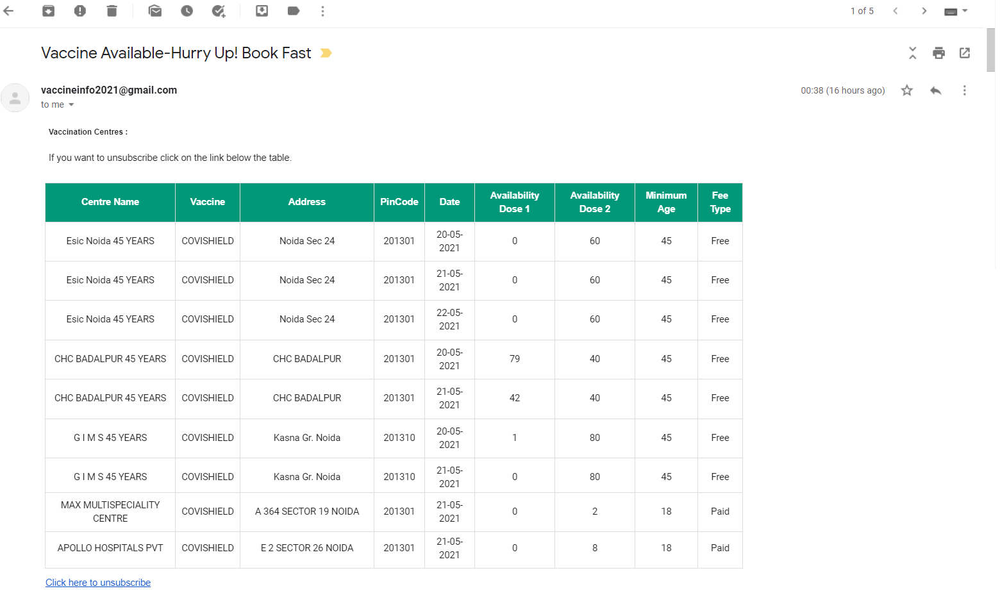
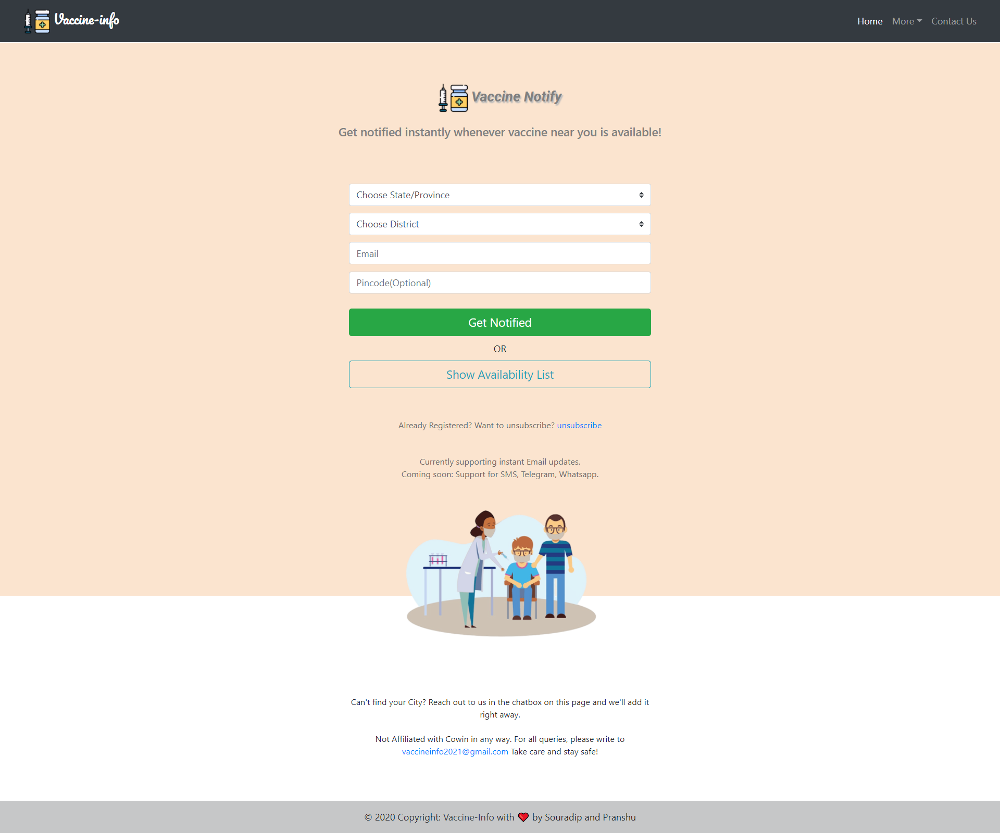
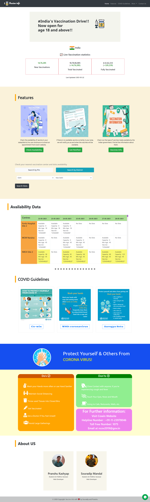
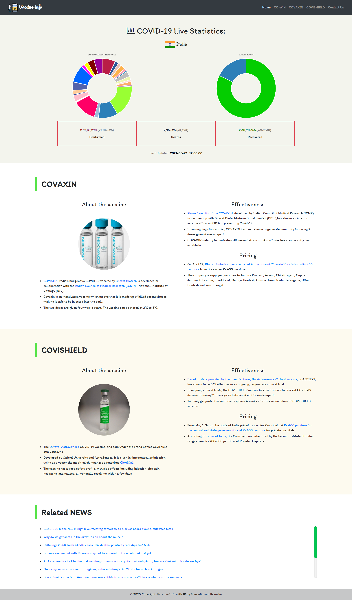

# 💉 Vaccine-Info

Vaccine-Info is a maintained Project made by **[Pranshu Kashyap](https://github.com/pranshukas)** and **[Souradip Mandal](https://github.com/deep2609)**. It uses Cowin API's to fetch Real time Vaccine Slots Available in Pin Code or Districts and diplays to user. Additionally it has another great Functionality Vaccine-Notifier. User can subscibe in case vaccine is not available, and it will check and automatically send Emails whenever new slots are available in nearest area. Additionally we have also added a webpage which displays Realtime Covid-19 Cases (Fetched using API's) and details of Vaccines available and Breaking News Related to Covid and Vaccinations. 

We have used node-cron for scheduling tasks and node-mailer for Sending Emails. MongoDB was used to Store User Data. Cowin API's are used for fetching real time Vaccine slots. Chat.js was used for plotting Doughnut Pie Charts and NewsAPIs was used for getting News Headlines related to Covid. 

## Contributors 

## Table of Content 

* [Deployment](#deployment)
* [Tools and Technologies Used](#tools-and-technologies-used)
* [Usage](#usage)
* [Installation](#installation)
* [Contribution](#contribution)
* [License](#license)

## Deployment 

Deployed Website (on Heroku): https://vaccine-info-2021.herokuapp.com/

<h4>Succesful Email Sent!</h4>

<h4>Notify Page (Simple UI)</h4>

## Tools and Technologies Used

#### Front-End   

    &nbsp;&nbsp;&nbsp;
    &nbsp;&nbsp;&nbsp;
    &nbsp;&nbsp;&nbsp;
    &nbsp;&nbsp;&nbsp;
    &nbsp;&nbsp;&nbsp;
    &nbsp;&nbsp;&nbsp;
 

 
 #### Back-End  
 
 

    &nbsp;&nbsp;&nbsp;
    &nbsp;&nbsp;&nbsp;
    &nbsp;&nbsp;&nbsp;
 

 
 #### Deployment and Miscellaneous Tools Used   
 
 

    &nbsp;&nbsp;&nbsp;
    &nbsp;&nbsp;&nbsp;
    

## Usage

Make changes to API in newapi.js for using the NewsAPIs. Update Your Password and Email Id in .env file. Udpate the MongoDB Atlas Path for using MongoDB and storing Users data (can update acc. to your need if want to store on local worksytem). 

## Installation

1. Run `npm install`
2. Dependencies are `express body-parser request nodemailer node-cron moment path mongodb https dotenv`
3. Now run on Local Host use `node app.js`
4. Open `http://localhost:3000/` to view the Document

## Contribution

The Project is open to Contribution for making it more better in terms of design, functionality and reach more People. UI is kept simple for now, but needs to be improved. For lower screens responsiveness needed to be made better. 

😃 Feel free to Reach out to us! **[Pranshu Kashyap](https://github.com/pranshukas)** **[Souradip Mandal](https://github.com/deep2609)** 

## License

This project is licensed under the MIT License.

Copyright (c) 2021 Vaccine Info

Permission is hereby granted, free of charge, to any person obtaining a copy
of this software and associated documentation files (the "Software"), to deal
in the Software without restriction, including without limitation the rights
to use, copy, modify, merge, publish, distribute, sublicense, and/or sell
copies of the Software, and to permit persons to whom the Software is
furnished to do so, subject to the following conditions:

The above copyright notice and this permission notice shall be included in all
copies or substantial portions of the Software.

THE SOFTWARE IS PROVIDED "AS IS", WITHOUT WARRANTY OF ANY KIND, EXPRESS OR
IMPLIED, INCLUDING BUT NOT LIMITED TO THE WARRANTIES OF MERCHANTABILITY,
FITNESS FOR A PARTICULAR PURPOSE AND NONINFRINGEMENT. IN NO EVENT SHALL THE
AUTHORS OR COPYRIGHT HOLDERS BE LIABLE FOR ANY CLAIM, DAMAGES OR OTHER
LIABILITY, WHETHER IN AN ACTION OF CONTRACT, TORT OR OTHERWISE, ARISING FROM,
OUT OF OR IN CONNECTION WITH THE SOFTWARE OR THE USE OR OTHER DEALINGS IN THE
SOFTWARE.

<h2>Screenshots of Pages</h2>

